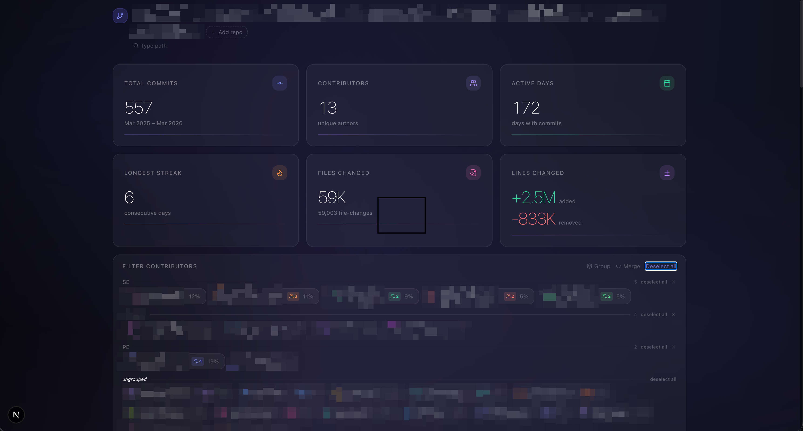
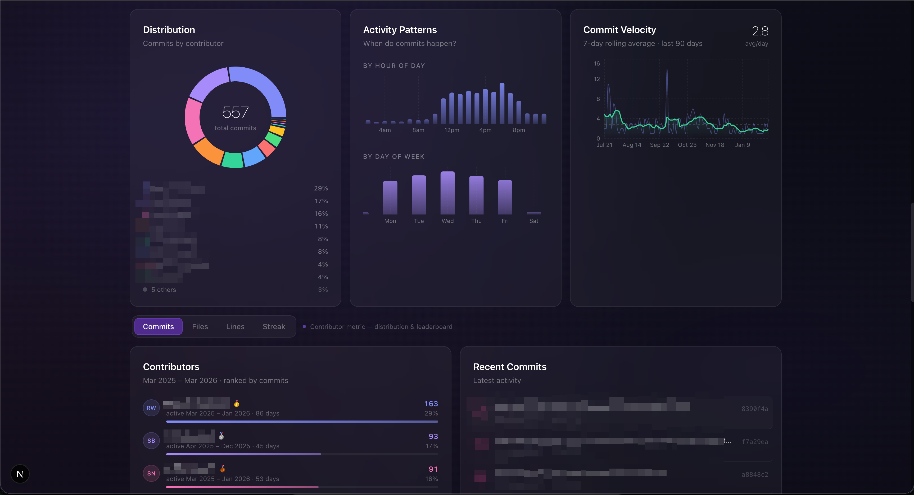
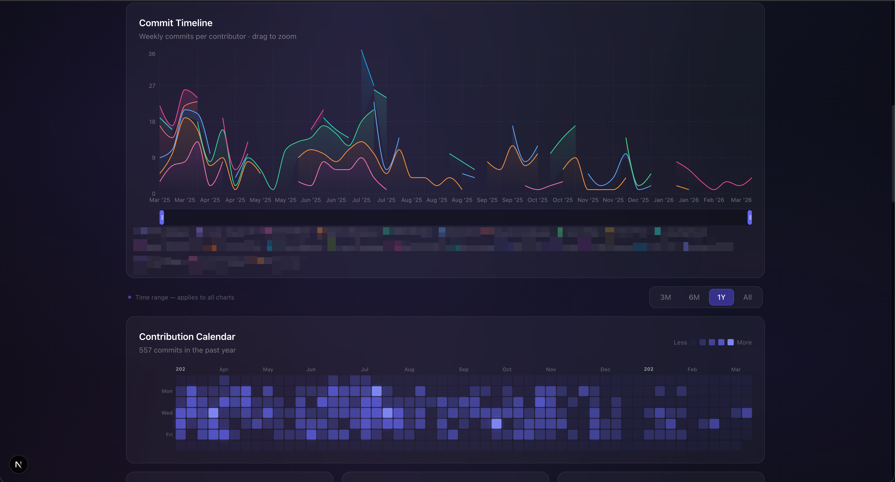
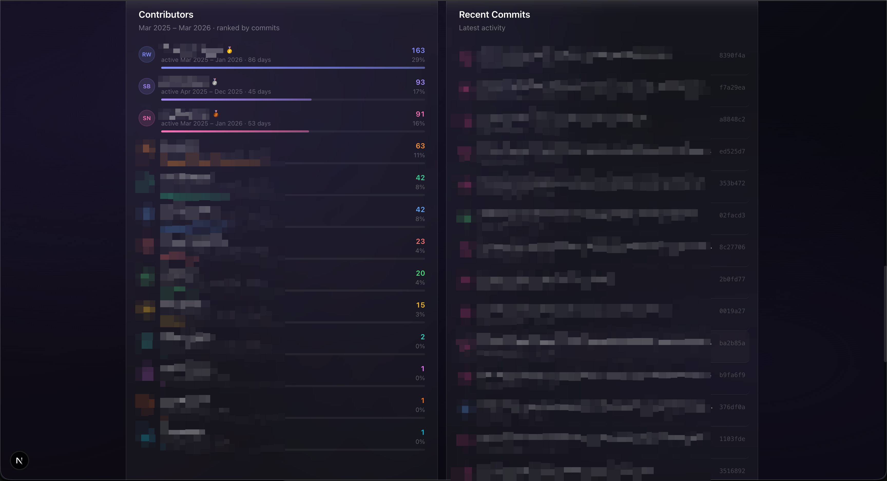

# commit·viz

Beautiful, local-first analytics for your git repositories. Run it against any repo on your machine — no accounts, no telemetry, no cloud.

## commit-viz dashboard 






## Features

- **Commit timeline** — stacked area chart per contributor with a draggable brush for zooming into any window
- **Contribution heatmap** — GitHub-style activity grid for the past year
- **Commit distribution** — donut chart showing share by contributor
- **Activity charts** — hourly and day-of-week breakdown of when commits happen
- **Velocity chart** — daily commit count with a 7-day rolling average
- **Leaderboard** — ranked contributors with a toggle between commits, files changed, lines changed, and longest streak
- **Multi-repo** — analyze multiple repositories together as a single merged dataset
- **Time range filter** — 3M / 6M / 1Y / All, applies to every chart simultaneously
- **Contributor filter** — show/hide individual contributors, with named sections and select-all/deselect-all per group
- **Identity merging** — consolidate multiple git identities (different emails, name variations) into a single contributor
- **Display name aliases** — rename any contributor without touching the repo

## Requirements

- Node.js 18+
- npm
- A local git repository

## Getting started

```bash
git clone https://github.com/your-username/commit-viz
cd commit-viz
npm install
npm run dev
```

Open [http://localhost:3000](http://localhost:3000), paste or browse to a local git repo path, and the dashboard loads instantly.

## Stack

| Layer | Technology |
|---|---|
| Framework | Next.js 15 (App Router) |
| Language | TypeScript |
| Styling | Tailwind CSS |
| API | tRPC v11 + TanStack Query v5 |
| Git parsing | simple-git (server-side) |
| Charts | Recharts |
| Animations | Framer Motion |
| Icons | Lucide React |
| Dates | date-fns v3 |

All git operations run server-side via tRPC — the browser never touches the filesystem directly. Repository data is not persisted anywhere; it's parsed on demand and held in memory for the session.

## Usage

### Single repo
Enter the absolute path to any local git repository (e.g. `/Users/you/code/my-app`) using the path input or the folder browser.

### Multiple repos
Click **Add repo** in the header to overlay a second (or third…) repository on the same dashboard. Commits, contributors, and charts are merged automatically.

### Contributor management
Click any contributor avatar to rename them. Use the **merge identities** button to combine multiple git identities into one canonical name. Organize contributors into named sections (e.g. "Backend", "Frontend") using the group editor.

### Time range
The period selector (3M / 6M / 1Y / All) filters every chart simultaneously — stat cards, heatmap, velocity, distribution, and leaderboard all reflect the same window.

### Contributor metric
The toggle between the distribution row and the leaderboard switches all contributor-ranked views between:
- **Commits** — commit count in the selected period
- **Files** — total files changed (all time)
- **Lines** — total lines added + removed (all time)
- **Streak** — longest consecutive active day run in the selected period

## License

MIT
